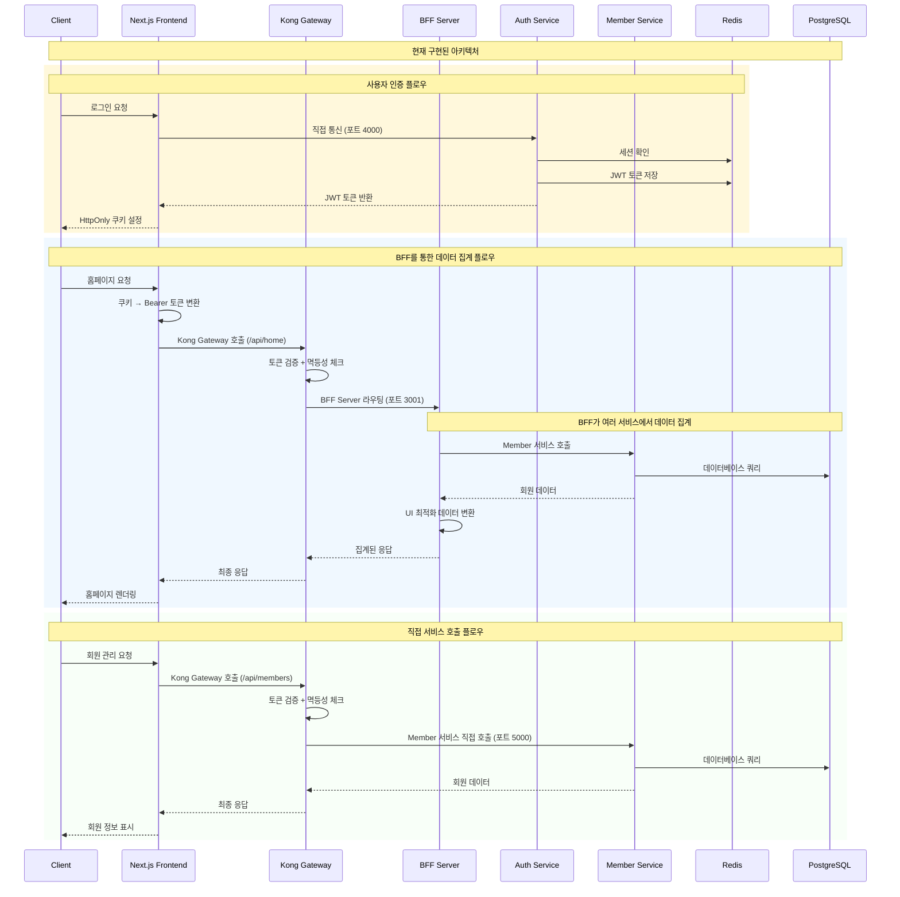
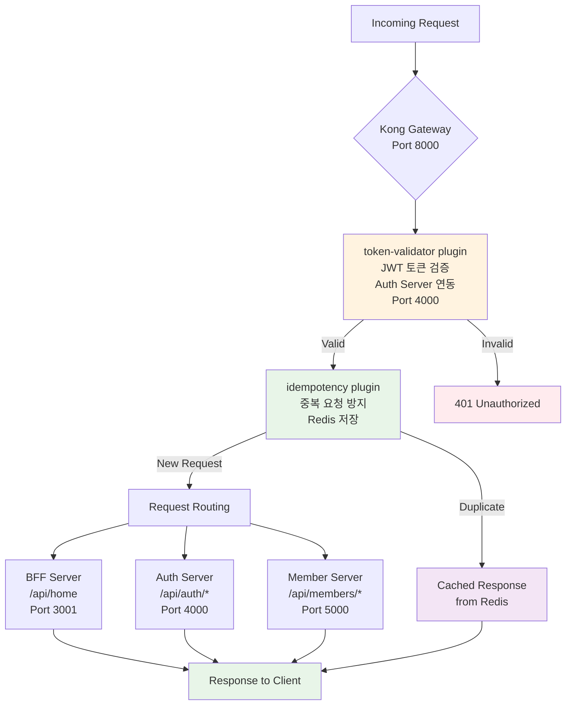

```mermaid
graph LR
    subgraph "External Network"
        Internet[Internet]
        Client[Client Applications]
    end

    subgraph "Docker Network: app-network"
        subgraph "Frontend"
            NextJS[Next.js<br/>Port 3000]
        end

        subgraph "Gateway Layer"
            Kong[Kong Gateway<br/>Proxy: 8000]
        end

        subgraph "Service Mesh"
            Auth[koa-auth-server<br/>Port 4000]
            Member[fastify-member-server<br/>Port 5000]
            BFF[bff-server<br/>Port 3001]
        end

        subgraph "Data Layer"
            Redis[Redis<br/>Sessions & Cache]
            PostgreSQL[PostgreSQL<br/>Member Data]
        end
    end

    %% External connections
    Internet --> Client
    Client -->|HTTP Port 3000| NextJS

    %% Internal network connections
    NextJS -.->|Direct Auth| Auth
    NextJS -->|API Gateway| Kong

    Kong --> BFF
    Kong --> Auth
    Kong --> Member

    %% BFF connections (ë°ì´í„° 집계만)
    BFF --> Member

    %% Data connections
    Auth --> Redis
    Member --> PostgreSQL
    Kong --> Redis

    %% Port exposure
    NextJS -.->|Exposed| Internet
    Kong -.->|Exposed| Internet

    style Kong fill:#e8f5e8
    style BFF fill:#e1f5fe
    style Redis fill:#ffebee
    style PostgreSQL fill:#f1f8e9
```

# E-Commerce 플랫폼

마이크로서비스 아키텍처 기반의 이커머스 플랫폼으로, Kong API Gateway와 BFF(Backend for Frontend) 패턴을 적용한 현대적인 웹 애플리케이션입니다.

## 🏗️ 시스템 아키텍처

```mermaid
graph TB
    subgraph "External"
        Client[클라이언트<br/>브라우저/앱]
    end

    subgraph "Frontend Layer"
        Frontend[Next.js<br/>E-Commerce App<br/>:3000<br/>API Routes /api/*<br/>HttpOnly 쿠키 → Bearer 토큰 변환]
    end

    subgraph "Internal Docker Network<br/>(외부 접근 차단)"
        subgraph "API Gateway"
            Kong[Kong API Gateway<br/>:8000<br/>• API 프록시<br/>• JWT 토큰 검증<br/>• 멱등성 처리<br/>• 라우팅]
        end

        subgraph "Authentication Layer"
            Auth[Auth 서비스<br/>Koa.js<br/>:4000<br/>• JWT 발급/검증<br/>• 사용자 인증<br/>• 세션 관리]
        end

        subgraph "BFF Layer"
            BFF[BFF Server<br/>Fastify<br/>:3001<br/>• 데이터 집계<br/>• UI 최적화 변환<br/>• 비즈니스 로직 조합]
        end

        subgraph "Business Services"
            Member[Member 서비스<br/>Fastify<br/>:5000<br/>• 회원 관리<br/>• CRUD 연산]
            Other[기타 비즈니스 서비스<br/>(미구현)<br/>• Product<br/>• Order<br/>• Payment]
        end

        subgraph "Data Layer"
            Redis[(Redis<br/>토큰 저장<br/>세션 관리<br/>멱등성 캐시)]
            PostgreSQL[(PostgreSQL<br/>Database<br/>회원 데이터)]
        end
    end

    %% External connections
    Client -->|HTTP 요청| Frontend
    Frontend -->|HTTP 응답| Client

    %% Frontend to internal services
    Frontend -->|API Routes<br/>/api/*| Kong
    Frontend -.->|직접 인증| Auth

    %% Kong routing
    Kong --> BFF
    Kong --> Auth
    Kong --> Member

    %% BFF connections (데이터 집계만)
    BFF --> Member
    BFF --> Other

    %% Service to data connections
    Auth --> Redis
    Member --> PostgreSQL

    %% Styling
    style Client fill:#e3f2fd
    style Frontend fill:#f3e5f5
    style Kong fill:#e8f5e8
    style Auth fill:#fff3e0
    style BFF fill:#e1f5fe
    style Member fill:#fff3e0
    style Redis fill:#ffebee
    style PostgreSQL fill:#f1f8e9
    style Other fill:#fafafa
```

## 🔄 데이터 플로우



## 🏭 Kong Gateway 플러그인 구성



## 🚀 주요 특징

### 🔒 보안 & 인증
- **Kong API Gateway**: 중앙집중식 API 관리 및 보안
- **JWT 기반 인증**: token-validator 플러그인으로 토큰 검증
- **Redis 세션 관리**: 확장 가능한 세션 저장소
- **멱등성 보장**: 중복 요청 방지 (Redis 기반)
- **내부 네트워크 격리**: Docker 네트워크로 서비스 보호

### ⚡ 성능 & 안정성
- **BFF 패턴**: 프론트엔드 최적화된 API 응답
- **마이크로서비스**: 서비스별 독립적 확장
- **멱등성 처리**: 안전한 재시도 메커니즘
- **Connection Pooling**: 데이터베이스 연결 최적화

### 🏗️ 아키텍처 패턴
- **Clean Architecture**: 계층 분리 및 의존성 관리
- **Domain-Driven Design**: 비즈니스 로직 중심 설계
- **API Gateway Pattern**: 중앙집중식 API 관리
- **Backend for Frontend**: 클라이언트 최적화

## 📦 서비스 구성

### 🌐 Kong API Gateway (:8000)
```yaml
역할: API 프록시 및 중앙 관리
기술 스택: Kong Community Edition
주요 기능:
  - API 라우팅 및 프록시
  - JWT 토큰 검증 (token-validator)
  - 멱등성 처리 (idempotency + Redis)
  - 플러그인 기반 확장

현재 활성 플러그인:
  - token-validator: JWT 토큰 검증
  - idempotency: 중복 요청 방지
```

### 🔄 BFF Server (:3001)
```yaml
역할: Frontend를 위한 API 집계 서버
기술 스택: Fastify + TypeScript
주요 기능:
  - 마이크로서비스 API 집계
  - 프론트엔드 최적화된 응답 변환
  - 비즈니스 로직 조합 (Auth 직접 연결 안함)
  - UI 최적화 데이터 가공

주요 엔드포인트:
  - GET /api/home: 홈페이지 데이터 집계
  - GET /health: 헬스 체크
  - GET /docs: API 문서
```

### 🔐 Auth Server (:4000)
```yaml
역할: 사용자 인증 및 권한 관리
기술 스택: Koa.js + TypeScript
주요 기능:
  - JWT 토큰 발급 및 검증
  - 사용자 인증/인가
  - Redis 기반 세션 관리
  - 비밀번호 암호화 (bcrypt)
  - Basic Auth 헤더 검증

주요 엔드포인트:
  - POST /api/auth/login: 사용자 로그인
  - POST /api/auth/register: 사용자 등록
  - POST /api/auth/refresh: 토큰 갱신
  - POST /api/auth/logout: 로그아웃
  - POST /api/auth/verify: 토큰 검증
```

### 👥 Member Server (:5000)
```yaml
역할: 회원 정보 관리
기술 스택: Fastify + Prisma + TypeScript
주요 기능:
  - 회원 CRUD 연산
  - Prisma ORM 기반 데이터 접근
  - 멱등성 미들웨어 지원
  - PostgreSQL 연동

주요 엔드포인트:
  - GET /api/members: 회원 목록 조회
  - POST /api/members: 회원 생성
  - GET /api/members/:id: 특정 회원 조회
  - PUT /api/members/:id: 회원 정보 수정
  - DELETE /api/members/:id: 회원 삭제
```

### 🎨 Frontend (:3000)
```yaml
역할: 사용자 인터페이스
기술 스택: Next.js 14 + TypeScript
아키텍처: Domain-Driven Design (DDD)
주요 기능:
  - App Router 기반 라우팅
  - 도메인별 상태 관리 (Zustand)
  - Server-Side Rendering
  - HttpOnly 쿠키 → Bearer 토큰 변환

디렉토리 구조:
  - src/domains/: 도메인별 로직 분리
  - src/components/: 재사용 가능한 컴포넌트
  - src/api/: API 클라이언트
```

## 🌐 네트워크 구성



## 🚀 시작하기

### 📋 요구사항
- Node.js 18+
- npm 9+
- Docker & Docker Compose
- Redis (Cloud 또는 로컬)

### 🛠️ 설치 및 실행

1. **저장소 클론**
```bash
git clone [repository-url]
cd [repository-name]
```

2. **의존성 설치**
```bash
# 공통 모듈
cd common && npm install && cd ..

# BFF 서버
cd bff-server && npm install && cd ..

# 인증 서버
cd koa-auth-server && npm install && cd ..

# 회원 서버
cd fastify-member-server && npm install && cd ..

# 프론트엔드
cd ecommerce-app && npm install && cd ..
```

3. **환경 변수 설정**

**Kong 설정**
```bash
# kong/.env
KONG_DATABASE=off
KONG_DECLARATIVE_CONFIG=/tmp/kong.yml
KONG_PROXY_ACCESS_LOG=/dev/stdout
KONG_ADMIN_ACCESS_LOG=/dev/stdout
KONG_PROXY_ERROR_LOG=/dev/stderr
KONG_ADMIN_ERROR_LOG=/dev/stderr
KONG_ADMIN_LISTEN=0.0.0.0:8001

# Redis 설정 (클라우드 또는 로컬)
REDIS_URL=your-redis-host
REDIS_PORT=6379
REDIS_PASSWORD=your-redis-password
REDIS_DB=0
IDEMPOTENCY_TTL=3600

# 서비스 URL (정확한 포트)
MEMBER_SERVER_URL=http://fastify-member-server:5000
AUTH_SERVER_URL=http://koa-auth-server:4000
BFF_SERVER_URL=http://bff-server:3001

# 활성 플러그인
KONG_PLUGINS=token-validator,idempotency
```

4. **Docker Compose 실행**
```bash
docker-compose up --build
```

## 🌐 서비스 엔드포인트

| 서비스 | 포트 | URL | 설명 |
|--------|------|-----|------|
| Kong Gateway | 8000 | http://localhost:8000 | API Gateway 프록시 |
| BFF Server | 3001 | http://localhost:3001 | Backend for Frontend |
| Auth Server | 4000 | http://localhost:4000 | 인증 서비스 |
| Member Server | 5000 | http://localhost:5000 | 회원 서비스 |
| Frontend | 3000 | http://localhost:3000 | 웹 애플리케이션 |

## 📊 API 사용 예시

### 1. 사용자 인증
```bash
# 로그인 (Basic 인증 헤더 포함)
curl -X POST http://localhost:4000/api/auth/login \
  -H "Content-Type: application/json" \
  -H "Authorization: Basic $(echo -n 'your-auth-basic-key' | base64)" \
  -d '{"email": "test@example.com", "password": "password123"}'
```

### 2. Kong Gateway를 통한 API 호출
```bash
# BFF 서버 호출 (홈페이지 데이터 집계)
curl http://localhost:8000/api/home \
  -H "Authorization: Bearer your-jwt-token" \
  -H "X-Idempotency-Key: unique-key-123"

# 회원 서비스 직접 호출
curl http://localhost:8000/api/members \
  -H "Authorization: Bearer your-jwt-token" \
  -H "X-Idempotency-Key: unique-key-456"
```

### 3. 직접 서비스 호출 (개발/테스트용)
```bash
# Auth 서버 직접 호출
curl -X POST http://localhost:4000/api/auth/login \
  -H "Content-Type: application/json" \
  -H "Authorization: Basic $(echo -n '${AUTH_BASIC_KEY}' | base64)" \
  -d '{"email": "test@example.com", "password": "password123"}'

# Member 서버 직접 호출
curl http://localhost:5000/api/members \
  -H "Authorization: Bearer your-jwt-token"

# BFF 서버 직접 호출 (데이터 집계 확인)
curl http://localhost:3001/api/home \
  -H "Authorization: Bearer your-jwt-token"
```

## 🧪 테스트

### 통합 테스트 시나리오
```bash
# 1. Auth 서버 로그인 테스트
curl -X POST http://localhost:4000/api/auth/login \
  -H "Content-Type: application/json" \
  -H "Authorization: Basic $(echo -n '${AUTH_BASIC_KEY}' | base64)" \
  -d '{"email": "test@example.com", "password": "password123"}'

# 2. Kong Gateway를 통한 BFF 호출
TOKEN="eyJhbGciOiJIUzI1NiIsInR5cCI6IkpXVCJ9..." # 위에서 받은 토큰
curl http://localhost:8000/api/home \
  -H "Authorization: Bearer $TOKEN" \
  -H "X-Idempotency-Key: test-key-1"

# 3. 멱등성 테스트 (같은 키로 재요청)
curl http://localhost:8000/api/home \
  -H "Authorization: Bearer $TOKEN" \
  -H "X-Idempotency-Key: test-key-1"

# 4. Member 서비스 테스트
curl http://localhost:8000/api/members \
  -H "Authorization: Bearer $TOKEN" \
  -H "X-Idempotency-Key: test-key-2"
```

## 🔧 개발 가이드

### BFF 서버 데이터 집계 패턴
```typescript
// BFF에서 여러 서비스 데이터 집계 예시
export class HomePageService {
  async getHomePageData(): Promise<HomePageResponse> {
    // 1. Member 서비스에서 사용자 통계
    const memberStats = await this.memberService.getStats();

    // 2. 다른 비즈니스 서비스들에서 데이터 가져오기 (미구현)
    // const products = await this.productService.getFeatured();
    // const orders = await this.orderService.getRecent();

    // 3. UI 최적화된 형태로 데이터 변환
    return {
      memberCount: memberStats.total,
      // featuredProducts: products.map(transformForUI),
      // recentOrders: orders.slice(0, 5)
    };
  }
}
```

### 새로운 비즈니스 서비스 추가
1. **Kong에 서비스 추가**
```yaml
# kong/kong.yml.template
services:
  - name: product-service
    url: http://product-service:6000
    routes:
      - name: product-api
        paths:
          - /api/products
        plugins:
          - name: token-validator
          - name: idempotency
```

2. **BFF에서 서비스 호출 추가**
```typescript
// BFF에서 새 서비스 연동
export class BFFService {
  constructor(
    private memberService: MemberService,
    private productService: ProductService // 새 서비스 추가
  ) {}
}
```

## 🔮 향후 계획

### Phase 1: 현재 완료된 기능 ✅
- Kong API Gateway 구축
- BFF 서버 구현 (데이터 집계 전용)
- JWT 기반 인증 체계
- 멱등성 처리 (Redis)
- 마이크로서비스 아키텍처

### Phase 2: 비즈니스 서비스 확장
- [ ] **Product Service**: 상품 관리 서비스 (포트 6000)
- [ ] **Order Service**: 주문 관리 서비스 (포트 7000)
- [ ] **Payment Service**: 결제 처리 서비스 (포트 8000)
- [ ] **BFF 데이터 집계**: 다중 서비스 조합

### Phase 3: 성능 최적화
- [ ] **Kong 캐싱**: 엔드포인트별 캐싱 전략
- [ ] **BFF 응답 캐싱**: 집계된 데이터 캐싱
- [ ] **Database 최적화**: 인덱싱 및 쿼리 최적화

### Phase 4: 모니터링 & 관찰성
- [ ] **메트릭 수집**: Prometheus + Grafana
- [ ] **분산 추적**: 서비스 간 호출 추적
- [ ] **로그 집계**: 중앙집중식 로깅
- [ ] **알림 체계**: 장애 알림 시스템

## 🔍 트러블슈팅

### 일반적인 문제들

**Kong Gateway 연결 실패**
```bash
# Kong 상태 확인
docker logs kong

# 서비스 연결 확인
docker exec -it kong ping bff-server
docker exec -it kong ping koa-auth-server
docker exec -it kong ping fastify-member-server
```

**BFF 데이터 집계 실패**
```bash
# BFF 서버 로그 확인
docker logs bff-server

# Member 서비스 연결 테스트
docker exec -it bff-server curl http://fastify-member-server:5000/health
```

**토큰 검증 실패**
```bash
# Auth 서버 로그 확인
docker logs koa-auth-server

# 토큰 유효성 수동 확인
curl http://localhost:4000/api/auth/verify \
  -H "Authorization: Bearer your-token"
```

## 📚 참고 문서

- [Kong Gateway 공식 문서](https://docs.konghq.com/)
- [Fastify 문서](https://www.fastify.io/)
- [Next.js 문서](https://nextjs.org/docs)
- [Prisma ORM 문서](https://www.prisma.io/docs)
- [Docker Compose 문서](https://docs.docker.com/compose/)
- [Koa 문서](https://koajs.com/)

## 📄 라이선스

MIT License

---

**현재 구현된 아키텍처**: Kong Gateway + BFF Pattern + JWT Auth + Microservices
**다음 단계**: 비즈니스 서비스 확장
