# E-Commerce 플랫폼

마이크로서비스 아키텍처 기반의 이커머스 플랫폼으로, Kong API Gateway와 BFF(Backend for Frontend) 패턴을 적용한 현대적인 웹 애플리케이션입니다.
## UI


## LightHouse


## 🚀 이미지 최적화 성능 비교

### Cloudflare Workers vs Next.js Image 응답속도 테스트

로컬 환경에서 동일한 이미지(120x120px WebP)에 대한 응답속도 측정 결과, **Next.js Image가 압도적으로 빠른 성능**을 보였습니다.

> **참고**: Cloudflare Workers는 직접 구현한 이미지 리사이저 API(`image-resizer.star1231076.workers.dev`)를 사용하여 구현되었으며, Next.js Image는 내장 최적화 엔진을 사용합니다.

#### 응답속도 측정 결과 (5회 평균)

| 서비스 | 평균 응답시간 | 성능 차이 |
|--------|--------------|----------|
| **Cloudflare Workers** | **0.181초** | 기준 |
| **Next.js Image** | **0.0038초** | **47배 빠름** 🏆 |

#### 상세 측정 데이터

**Cloudflare Workers 응답시간:**
```
0.149s → 0.176s → 0.210s → 0.192s → 0.177s
평균: 0.181초
```

**Next.js Image 응답시간 (공인 IP 접근):**
```
0.0040s → 0.0039s → 0.0037s → 0.0038s → 0.0040s  
평균: 0.0038초
```

#### 테스트 조건
- **환경**: 로컬 개발 서버 (공인 IP 포트포워딩)
- **이미지**: `product-default.jpg` → 120x120px WebP 변환
- **측정 도구**: curl with timing metrics
- **네트워크**: 외부 인터넷 접근 (공정한 비교를 위해 수정)

> **테스트 개선**: 기존 `localhost:3000` 호출은 로컬 네트워크로 인해 불공정했습니다. 공인 IP를 통한 외부 접근으로 수정하여 Cloudflare Workers와 동일한 네트워크 조건에서 측정했습니다.

#### 테스트 명령어

**Cloudflare Workers 이미지 리사이저:**
```bash
curl -w "Total time: %{time_total}s\nDNS lookup: %{time_namelookup}s\nConnect: %{time_connect}s\nSSL handshake: %{time_appconnect}s\nTime to first byte: %{time_starttransfer}s\nDownload: %{time_download}s\nHTTP code: %{http_code}\nSize: %{size_download} bytes\n" -o /dev/null -s "https://image-resizer.star1231076.workers.dev/?url=https://static.kbs-cdn.shop/image/product-default.jpg&w=120&h=120&fit=cover&f=webp"
```

**Next.js Image 최적화 (공인 IP 접근):**
```bash
curl -w "Total time: %{time_total}s\nDNS lookup: %{time_namelookup}s\nConnect: %{time_connect}s\nSSL handshake: %{time_appconnect}s\nTime to first byte: %{time_starttransfer}s\nDownload: %{time_download}s\nHTTP code: %{http_code}\nSize: %{size_download} bytes\n" -o /dev/null -s "http://YOUR_PUBLIC_IP:3000/_next/image?url=https%3A%2F%2Fstatic.kbs-cdn.shop%2Fimage%2Fproduct-default.jpg&w=120&q=75"
```

#### 분석 및 결론

**Next.js Image 압도적 우세 요인:**
- **로컬 캐싱**: 한 번 처리된 이미지는 로컬에 캐시되어 즉시 응답
- **내장 최적화**: Next.js 내장 이미지 최적화 엔진의 효율성
- **네트워크 지연 없음**: 로컬 서버에서 직접 처리

**Cloudflare Workers 지연 요인 (첫 번째 요청):**
- **외부 API 사용**: 무료 이미지 리사이저 API 서비스 호출
- **외부 네트워크 호출**: 매번 Cloudflare 엣지 서버까지 요청
- **온디맨드 처리**: 첫 요청 시에만 이미지 변환 처리  
- **네트워크 RTT**: 왕복 네트워크 지연시간 포함

**Cloudflare Workers 캐싱 전략:**
- **강력한 캐싱**: `Cache-Control: public, max-age=86400, immutable` (24시간)
- **엣지 캐싱**: 두 번째 요청부터는 CDN 엣지에서 즉시 응답
- **글로벌 분산**: 전 세계 엣지 서버에서 캐시된 이미지 제공

#### 실제 프로덕션 환경 고려사항

**공정한 테스트 환경**: Next.js Image 우세 (47배 빠름)

**프로덕션 환경에서는 상황이 달라질 수 있음:**

**Cloudflare Workers 장점:**
- **첫 요청 후 즉시 캐싱**: 24시간 immutable 캐시로 극도로 빠른 재요청 응답
- **글로벌 엣지 분산**: 전 세계 200+ 엣지 서버에서 동일한 성능
- **지역별 일관성**: 사용자 위치와 관계없이 일관된 응답속도

**Next.js Image 제약:**
- **서버 위치 의존**: 애플리케이션 서버 위치에 따른 지역별 성능 차이
- **서버 부하**: 이미지 처리로 인한 애플리케이션 서버 리소스 사용

> **결론**: 
> - **개발/테스트 환경**: Next.js Image 우세 (47배 빠름)  
> - **글로벌 프로덕션**: Cloudflare Workers가 일관된 고성능 + 서버 부하 분산으로 유리
> - **반복 요청**: Cloudflare Workers는 캐시 히트 시 Next.js와 동등하거나 더 빠른 성능 예상

## 시스템 아키텍처

```mermaid
graph TB
    subgraph "External"
        Client[클라이언트 브라우저/앱]
    end

    subgraph "Frontend Layer"
        Frontend[Next.js E-Commerce App<br/>Port 3000<br/>API Routes /api/*<br/>쿠키 to Bearer 토큰 변환]
    end

    subgraph "Internal Docker Network"
        subgraph "API Gateway"
            Kong[Kong API Gateway<br/>Port 8000<br/>API 프록시<br/>JWT 토큰 검증<br/>멱등성 처리<br/>라우팅]
        end

        subgraph "Authentication Layer"
            Auth[Auth 서비스<br/>Koa.js Port 4000<br/>JWT 발급/검증<br/>사용자 인증<br/>세션 관리]
        end

        subgraph "BFF Layer"
            BFF[BFF Server<br/>Fastify Port 3001<br/>UI 최적화 변환<br/>비즈니스 로직 조합]
        end

        subgraph "Business Services"
            Member[Member 서비스<br/>Fastify Port 5000<br/>회원 관리<br/>CRUD 연산]
            Other[기타 비즈니스 서비스<br/>미구현 상태<br/>Product Order Payment]
        end

        subgraph "Data Layer"
            Redis[(Redis<br/>토큰 저장<br/>세션 관리<br/>멱등성 캐시)]
            PostgreSQL[(PostgreSQL Database<br/>회원 데이터)]
        end
    end

    %% External connections
    Client -->|HTTP 요청| Frontend
    Frontend -->|HTTP 응답| Client

    %% Frontend to internal services
    Frontend -->|API Routes /api/*| Kong
    Frontend -.->|직접 인증| Auth

    %% Kong routing
    Kong --> BFF
    Kong --> Auth
    Kong --> Member

    %% BFF connections - 데이터 집계만
    BFF --> Member
    BFF --> Other

    %% Service to data connections
    Auth --> Redis
    Member --> PostgreSQL

    %% Styling
    style Client fill:#e3f2fd
    style Frontend fill:#f3e5f5
    style Kong fill:#e8f5e8
    style Auth fill:#fff3e0
    style BFF fill:#e1f5fe
    style Member fill:#fff3e0
    style Redis fill:#ffebee
    style PostgreSQL fill:#f1f8e9
    style Other fill:#fafafa
```



## 데이터 플로우


## Kong Gateway 플러그인 구성


## 주요 특징

### 보안 & 인증
- **Kong API Gateway**: 중앙집중식 API 관리 및 보안
- **JWT 기반 인증**: token-validator 플러그인으로 토큰 검증
- **Redis 세션 관리**: 확장 가능한 세션 저장소
- **멱등성 보장**: 중복 요청 방지 (Redis 기반)
- **내부 네트워크 격리**: Docker 네트워크로 서비스 보호

### 성능 & 안정성
- **BFF 패턴**: 프론트엔드 최적화된 API 응답
- **마이크로서비스**: 서비스별 독립적 확장
- **멱등성 처리**: 안전한 재시도 메커니즘

### 아키텍처 패턴
- **Clean Architecture**: 계층 분리 및 의존성 관리
- **Domain-Driven Design**: 비즈니스 로직 중심 설계
- **API Gateway Pattern**: 중앙집중식 API 관리
- **Backend for Frontend**: 클라이언트 최적화

## 서비스 구성

### Kong API Gateway (:8000)
```yaml
역할: API 프록시 및 중앙 관리
기술 스택: Kong Community Edition 3.9
주요 기능:
  - API 라우팅 및 프록시
  - JWT 토큰 검증 (token-validator)
  - 멱등성 처리 (idempotency + Redis)
  - 플러그인 기반 확장
  - 자동 웜업 시스템 (warm-up.sh)

성능 최적화:
  - 메모리 사용량 75% 감소 (로그 레벨 error)
  - access 로그 비활성화로 I/O 부하 감소
  - worker 프로세스 최적화 (1개)
  - keepalive 설정 개선 (10000 requests, 75s timeout)

현재 활성 플러그인:
  - token-validator: JWT 토큰 검증
  - idempotency: 중복 요청 방지

웜업 엔드포인트:
  - /health: Kong 자체 상태 확인
  - /api/auth/health: Auth 서비스 웜업
  - /api/members/health: Members 서비스 웜업 (토큰 필요)
  - /api/home: BFF 서비스 웜업 (토큰 필요)
```

### BFF Server (:3001)
```yaml
역할: Frontend를 위한 API 집계 서버
기술 스택: Fastify + TypeScript
주요 기능:
  - 마이크로서비스 API 집계
  - 프론트엔드 최적화된 응답 변환
  - 비즈니스 로직 조합 (Auth 직접 연결 안함)
  - UI 최적화 데이터 가공

주요 엔드포인트:
  - GET /api/home: 홈페이지 데이터 집계
  - GET /health: 헬스 체크
  - GET /docs: API 문서
```

### Auth Server (:4000)
```yaml
역할: 사용자 인증 및 권한 관리
기술 스택: Koa.js + TypeScript
주요 기능:
  - JWT 토큰 발급 및 검증
  - 사용자 인증/인가
  - Redis 기반 세션 관리
  - 비밀번호 암호화 (bcrypt)
  - Basic Auth 헤더 검증

주요 엔드포인트:
  - POST /api/auth/login: 사용자 로그인
  - POST /api/auth/register: 사용자 등록
  - POST /api/auth/refresh: 토큰 갱신
  - POST /api/auth/logout: 로그아웃
  - POST /api/auth/verify: 토큰 검증
```

### Member Server (:5000)
```yaml
역할: 회원 정보 관리
기술 스택: Fastify + Prisma + TypeScript
주요 기능:
  - 회원 CRUD 연산
  - Prisma ORM 기반 데이터 접근
  - 멱등성 미들웨어 지원
  - PostgreSQL 연동

주요 엔드포인트:
  - GET /api/members: 회원 목록 조회
  - POST /api/members: 회원 생성
  - GET /api/members/:id: 특정 회원 조회
  - PUT /api/members/:id: 회원 정보 수정
  - DELETE /api/members/:id: 회원 삭제
```

### Frontend (:3000)
```yaml
역할: 사용자 인터페이스
기술 스택: Next.js 14 + TypeScript
아키텍처: Domain-Driven Design (DDD)
주요 기능:
  - App Router 기반 라우팅
  - 도메인별 상태 관리 (Zustand)
  - Server-Side Rendering (홈페이지)
  - HttpOnly 쿠키 → Bearer 토큰 변환
  - CDN 이미지 최적화 (Cloudflare Workers)

성능 최적화:
  - 홈페이지 SSR 전환으로 초기 로딩 속도 향상
  - 이미지 WebP 변환 및 리사이징 자동화
  - Next.js Image 최적화 설정 개선
    - next/image로 인한 부하 책임 CDN으로 위임.

디렉토리 구조:
  - src/domains/: 도메인별 로직 분리
  - src/components/: 재사용 가능한 컴포넌트
  - src/api/: API 클라이언트
```

## 네트워크 구성


## 시작하기

### 요구사항
- Node.js 18+
- npm 9+
- Docker & Docker Compose
- Redis (Cloud 또는 로컬)

### 설치 및 실행

1. **저장소 클론**
```bash
git clone [repository-url]
cd [repository-name]
```

2. **의존성 설치**
```bash
# 공통 모듈
cd common && npm install && cd ..

# BFF 서버
cd bff-server && npm install && cd ..

# 인증 서버
cd koa-auth-server && npm install && cd ..

# 회원 서버
cd fastify-member-server && npm install && cd ..

# 프론트엔드
cd ecommerce-app && npm install && cd ..
```

3. **환경 변수 설정**

**Kong 설정**
```bash
# kong/.env
KONG_DATABASE=off
KONG_DECLARATIVE_CONFIG=/tmp/kong.yml
KONG_PLUGINS=token-validator,idempotency

# Kong 성능 최적화
KONG_LOG_LEVEL=error
KONG_NGINX_WORKER_PROCESSES=1
KONG_NGINX_KEEPALIVE_REQUESTS=10000
KONG_NGINX_KEEPALIVE_TIMEOUT=75s
KONG_PROXY_ACCESS_LOG=off
KONG_ADMIN_ACCESS_LOG=off
KONG_PROXY_LISTEN=0.0.0.0:8000
KONG_ADMIN_LISTEN=0.0.0.0:8001, 0.0.0.0:8444 ssl

# Redis 설정 (클라우드 또는 로컬)
REDIS_URL=your-redis-host
REDIS_PORT=12020
REDIS_PASSWORD=your-redis-password
REDIS_DB=0
IDEMPOTENCY_TTL=60

# JWT 및 인증
JWT_SECRET=your-long-jwt-secret-key
TEST_TOKEN=your-test-token-for-warmup

# 서비스 URL (정확한 포트)
AUTH_SERVER_URL=http://koa-auth-server:4000
MEMBER_SERVER_URL=http://fastify-member-server:5000
BFF_SERVER_URL=http://bff-server:3001
```

**Frontend 설정 (추가)**
```bash
# ecommerce-app/.env
KONG_GATEWAY_URL=http://kong:8000
AUTH_SERVICE_URL=http://koa-auth-server:4000
AUTH_SERVICE_TIMEOUT=5000
AUTH_BASIC_KEY=your-auth-basic-key
NODE_ENV=development
AUTH_PREFIX=/api/auth
NEXT_PUBLIC_CDN_DOMAIN=https://your-cloudflare-workers-domain
```

4. **Docker Compose 실행**
```bash
docker-compose up --build
```

## 서비스 엔드포인트

| 서비스 | 포트 | URL | 설명 |
|--------|------|-----|------|
| Kong Gateway | 8000 | http://localhost:8000 | API Gateway 프록시 |
| BFF Server | 3001 | http://localhost:3001 | Backend for Frontend |
| Auth Server | 4000 | http://localhost:4000 | 인증 서비스 |
| Member Server | 5000 | http://localhost:5000 | 회원 서비스 |
| Frontend | 3000 | http://localhost:3000 | 웹 애플리케이션 |

## API 사용 예시

### 1. 사용자 인증
```bash
# 로그인 (Basic 인증 헤더 포함)
curl -X POST http://localhost:4000/api/auth/login \
  -H "Content-Type: application/json" \
  -H "Authorization: Basic $(echo -n 'your-auth-basic-key' | base64)" \
  -d '{"email": "test@example.com", "password": "password123"}'
```

### 2. Kong Gateway를 통한 API 호출
```bash
# BFF 서버 호출 (홈페이지 데이터 집계)
curl http://localhost:8000/api/home \
  -H "Authorization: Bearer your-jwt-token" \
  -H "X-Idempotency-Key: unique-key-123"

# 회원 서비스 직접 호출
curl http://localhost:8000/api/members \
  -H "Authorization: Bearer your-jwt-token" \
  -H "X-Idempotency-Key: unique-key-456"
```

### 3. 직접 서비스 호출 (개발/테스트용)
```bash
# Auth 서버 직접 호출
curl -X POST http://localhost:4000/api/auth/login \
  -H "Content-Type: application/json" \
  -H "Authorization: Basic $(echo -n '${AUTH_BASIC_KEY}' | base64)" \
  -d '{"email": "test@example.com", "password": "password123"}'

# Member 서버 직접 호출
curl http://localhost:5000/api/members \
  -H "Authorization: Bearer your-jwt-token"

# BFF 서버 직접 호출 (데이터 집계 확인)
curl http://localhost:3001/api/home \
  -H "Authorization: Bearer your-jwt-token"
```

## 테스트

### 통합 테스트 시나리오
```bash
# 1. Auth 서버 로그인 테스트
curl -X POST http://localhost:4000/api/auth/login \
  -H "Content-Type: application/json" \
  -H "Authorization: Basic $(echo -n '${AUTH_BASIC_KEY}' | base64)" \
  -d '{"email": "test@example.com", "password": "password123"}'

# 2. Kong Gateway를 통한 BFF 호출
TOKEN="eyJhbGciOiJIUzI1NiIsInR5cCI6IkpXVCJ9..." # 위에서 받은 토큰
curl http://localhost:8000/api/home \
  -H "Authorization: Bearer $TOKEN" \
  -H "X-Idempotency-Key: test-key-1"

# 3. 멱등성 테스트 (같은 키로 재요청)
curl http://localhost:8000/api/home \
  -H "Authorization: Bearer $TOKEN" \
  -H "X-Idempotency-Key: test-key-1"

# 4. Member 서비스 테스트
curl http://localhost:8000/api/members \
  -H "Authorization: Bearer $TOKEN" \
  -H "X-Idempotency-Key: test-key-2"
```

## 🔧 개발 가이드

### 새로운 비즈니스 서비스 추가
1. **Kong에 서비스 추가**
```yaml
# kong/kong.yml.template
services:
  - name: product-service
    url: http://product-service:6000
    routes:
      - name: product-api
        paths:
          - /api/products
        plugins:
          - name: token-validator
          - name: idempotency
```

2. **BFF에서 서비스 호출 추가**
```typescript
// BFF에서 새 서비스 연동
export class BFFService {
  constructor(
    private memberService: MemberService,
    private productService: ProductService // 새 서비스 추가
  ) {}
}
```

## 향후 계획

### Phase 1: 현재 완료된 기능
- Kong API Gateway 구축
- BFF 서버 구현 (비즈니스 데이터 UI 데이터를 변환하는 용도)
- JWT 기반 인증 체계
- 멱등성 처리 (Redis)
- 마이크로서비스 아키텍처

### Phase 2: 비즈니스 서비스 확장
- [ ] **Product Service**: 상품 관리 서비스 (포트 6000)
- [ ] **Order Service**: 주문 관리 서비스 (포트 7000)

### Phase 3: 성능 최적화 ✅
- [x] **Kong 성능 최적화**: 메모리 사용량 75% 감소, 로그 레벨 최적화
- [x] **웜업 시스템**: 컨테이너 시작 시 자동 웜업으로 초기 응답 속도 개선
- [x] **SSR 전환**: 홈페이지 서버사이드 렌더링으로 초기 로딩 속도 향상
- [x] **CDN 이미지 최적화**: Cloudflare Workers 기반 이미지 리사이징 및 WebP 변환
- [ ] **Kong 캐싱**: 엔드포인트별 캐싱 전략
- [ ] **BFF 응답 캐싱**: 집계된 데이터 캐싱

### Phase 4: 모니터링 & 관찰성
- [ ] **메트릭 수집**: Prometheus + Grafana
- [ ] **분산 추적**: 서비스 간 호출 추적
- [ ] **로그 집계**: 중앙집중식 로깅
- [ ] **알림 체계**: 장애 알림 시스템

## 트러블슈팅

### 일반적인 문제들

**Kong Gateway 연결 실패**
```bash
# Kong 상태 확인
docker logs kong

# 서비스 연결 확인
docker exec -it kong ping bff-server
docker exec -it kong ping koa-auth-server
docker exec -it kong ping fastify-member-server
```

**토큰 검증 실패**
```bash
# Auth 서버 로그 확인
docker logs koa-auth-server

# 토큰 유효성 수동 확인
curl http://localhost:4000/api/auth/verify \
  -H "Authorization: Bearer your-token"
```

## 참고 문서

- [Kong Gateway 공식 문서](https://docs.konghq.com/)
- [Fastify 문서](https://www.fastify.io/)
- [Next.js 문서](https://nextjs.org/docs)
- [Prisma ORM 문서](https://www.prisma.io/docs)
- [Docker Compose 문서](https://docs.docker.com/compose/)
- [Koa 문서](https://koajs.com/)

## 📄 라이선스

MIT License

---
