```mermaid
graph LR
    subgraph "프록시 경유 (포트 9000)"
        Client1["클라이언트"] --> Proxy["프록시 서버<br/>Redis 캐시 조회"]
        Proxy --> NextJS1["Next.js<br/>ISR 캐시(1분)"]
        NextJS1 --> Proxy
        Proxy --> Client1
    end

    subgraph "직접 접속 (포트 3000)"
        Client2["클라이언트"] --> NextJS2["Next.js<br/>ISR 캐시(1분)"]
        NextJS2 --> Client2
    end

    style Proxy fill:#f9f2ff
    style NextJS1 fill:#e8f5e8
    style NextJS2 fill:#e8f5e8
```

```mermaid
graph LR
    subgraph "프록시 경유 (포트 9000)"
        Client3["클라이언트"] --> Proxy2["프록시 서버<br/>Redis 캐시 조회"]
        Proxy2 --> NextJS3["Next.js<br/>실시간 렌더링"]
        NextJS3 --> Proxy2
        Proxy2 --> Client3
    end

    subgraph "직접 접속 (포트 3000)"
        Client4["클라이언트"] --> NextJS4["Next.js<br/>실시간 렌더링"]
        NextJS4 --> Client4
    end

    style Proxy2 fill:#f9f2ff
    style NextJS3 fill:#ffe8e8
    style NextJS4 fill:#ffe8e8
```

# E-Commerce 플랫폼

마이크로서비스 아키텍처 기반의 이커머스 플랫폼으로, Kong API Gateway, BFF(Backend for Frontend) 패턴, 그리고 Redis 기반 HTML 캐싱 프록시 서버를 적용한 현대적인 웹 애플리케이션입니다.
## UI


## LightHouse


## 🚀 이미지 최적화 성능 비교

### Cloudflare Workers vs Next.js Image 응답속도 테스트

로컬 환경에서 동일한 이미지(120x120px WebP)에 대한 응답속도 측정 결과, **Next.js Image가 압도적으로 빠른 성능**을 보였습니다.

> **참고**: Cloudflare Workers는 직접 구현한 이미지 리사이저 API(`image-resizer.star1231076.workers.dev`)를 사용하며, 내부적으로 3개의 무료 이미지 리사이징 서비스를 순차적으로 시도합니다:
> 1. **WSrv.nl** - 첫 번째 우선순위 서비스
> 2. **Statically** - 백업 서비스 #1
> 3. **Images.weserv.nl** - 백업 서비스 #2
>
> Next.js Image는 내장 최적화 엔진을 사용합니다.

#### 응답속도 측정 결과 (5회 평균)

| 서비스 | 평균 응답시간 | 성능 차이 |
|--------|--------------|----------|
| **Cloudflare Workers** | **0.181초** | 기준 |
| **Next.js Image** | **0.0038초** | **47배 빠름** 🏆 |

#### 상세 측정 데이터

**Cloudflare Workers 응답시간:**
```
0.149s → 0.176s → 0.210s → 0.192s → 0.177s
평균: 0.181초
```

**Next.js Image 응답시간 (공인 IP 접근):**
```
0.0040s → 0.0039s → 0.0037s → 0.0038s → 0.0040s
평균: 0.0038초
```

#### 테스트 조건
- **환경**: 로컬 개발 서버 (공인 IP 포트포워딩)
- **이미지**: `product-default.jpg` → 120x120px WebP 변환
- **측정 도구**: curl with timing metrics
- **네트워크**: 외부 인터넷 접근 (공정한 비교를 위해 수정)

> **테스트 개선**: 기존 `localhost:3000` 호출은 로컬 네트워크로 인해 불공정했습니다. 공인 IP를 통한 외부 접근으로 수정하여 Cloudflare Workers와 동일한 네트워크 조건에서 측정했습니다.

#### 테스트 명령어

**Cloudflare Workers 이미지 리사이저:**
```bash
curl -w "Total time: %{time_total}s\nDNS lookup: %{time_namelookup}s\nConnect: %{time_connect}s\nSSL handshake: %{time_appconnect}s\nTime to first byte: %{time_starttransfer}s\nDownload: %{time_download}s\nHTTP code: %{http_code}\nSize: %{size_download} bytes\n" -o /dev/null -s "https://image-resizer.star1231076.workers.dev/?url=https://static.kbs-cdn.shop/image/product-default.jpg&w=120&h=120&fit=cover&f=webp"
```

**Next.js Image 최적화 (공인 IP 접근):**
```bash
curl -w "Total time: %{time_total}s\nDNS lookup: %{time_namelookup}s\nConnect: %{time_connect}s\nSSL handshake: %{time_appconnect}s\nTime to first byte: %{time_starttransfer}s\nDownload: %{time_download}s\nHTTP code: %{http_code}\nSize: %{size_download} bytes\n" -o /dev/null -s "http://YOUR_PUBLIC_IP:3000/_next/image?url=https%3A%2F%2Fstatic.kbs-cdn.shop%2Fimage%2Fproduct-default.jpg&w=120&q=75"
```

#### 분석 및 결론

**Next.js Image 압도적 우세 요인:**
- **로컬 캐싱**: 한 번 처리된 이미지는 로컬에 캐시되어 즉시 응답
- **내장 최적화**: Next.js 내장 이미지 최적화 엔진의 효율성
- **네트워크 지연 없음**: 로컬 서버에서 직접 처리

**Cloudflare Workers 지연 요인 (첫 번째 요청):**
- **외부 API 체인**: WSrv.nl → Statically → weserv.nl 순차 시도
- **다중 네트워크 홉**: 사용자 → Cloudflare → 외부 리사이징 서비스 → 응답
- **서비스 대기시간**: 첫 번째 서비스 실패 시 다음 서비스 시도까지의 지연
- **온디맨드 처리**: 첫 요청 시에만 이미지 변환 처리
- **네트워크 RTT**: 여러 서비스 간 왕복 지연시간 누적

**Cloudflare Workers 캐싱 전략:**
- **강력한 캐싱**: `Cache-Control: public, max-age=86400, immutable` (24시간)
- **엣지 캐싱**: 두 번째 요청부터는 CDN 엣지에서 즉시 응답
- **글로벌 분산**: 전 세계 엣지 서버에서 캐시된 이미지 제공

#### 실제 프로덕션 환경 고려사항

**공정한 테스트 환경**: Next.js Image 우세 (47배 빠름)

**프로덕션 환경에서는 상황이 달라질 수 있음:**

**Cloudflare Workers 장점:**
- **첫 요청 후 즉시 캐싱**: 24시간 immutable 캐시로 극도로 빠른 재요청 응답
- **글로벌 엣지 분산**: 전 세계 200+ 엣지 서버에서 동일한 성능
- **지역별 일관성**: 사용자 위치와 관계없이 일관된 응답속도

**Next.js Image 제약:**
- **서버 위치 의존**: 애플리케이션 서버 위치에 따른 지역별 성능 차이
- **서버 부하**: 이미지 처리로 인한 애플리케이션 서버 리소스 사용

> **결론**:
> - **개발/테스트 환경**: Next.js Image 우세 (47배 빠름)
> - **글로벌 프로덕션**: Cloudflare Workers가 일관된 고성능 + 서버 부하 분산으로 유리
> - **반복 요청**: Cloudflare Workers는 캐시 히트 시 Next.js와 동등하거나 더 빠른 성능 예상

## 시스템 아키텍처

```mermaid
graph TB
    subgraph "External"
        Client[클라이언트 브라우저/앱]
    end

    subgraph "Proxy Layer"
        Proxy["Bun Proxy Server<br/>Port 9000<br/>HTML 캐싱 Redis<br/>RSC 직접 프록시<br/>게스트 토큰 발급"]
    end

    subgraph "Frontend Layer"
        Frontend["Next.js E-Commerce App<br/>Port 3000<br/>쿠키 to Bearer 토큰 변환"]
    end

    subgraph "Internal Docker Network"
        subgraph "API Gateway"
            Kong["Kong API Gateway<br/>Port 8000<br/>API 프록시<br/>JWT 토큰 검증<br/>멱등성 처리<br/>라우팅"]
        end

        subgraph "Authentication Layer"
            Auth["Auth 서비스<br/>Koa.js Port 4000<br/>JWT 발급/검증<br/>사용자 인증<br/>세션 관리"]
        end

        subgraph "BFF Layer"
            BFF["BFF Server<br/>Fastify Port 3001<br/>UI 최적화 변환<br/>비즈니스 로직 조합"]
        end

        subgraph "Business Services"
            Member["Member 서비스<br/>Fastify Port 5000<br/>회원 관리<br/>CRUD 연산"]
            Other["기타 비즈니스 서비스<br/>미구현 상태<br/>Product Order Payment"]
        end

        subgraph "Data Layer"
            Redis[("Redis<br/>토큰 저장<br/>세션 관리<br/>멱등성 캐시")]
            PostgreSQL[("PostgreSQL Database<br/>회원 데이터")]
        end
    end

    %% External connections
    Client -->|HTTP 요청| Proxy
    Proxy -->|캐시 HIT| Client
    Proxy -->|HTML/RSC 요청| Frontend
    Frontend -->|응답| Proxy
    Proxy -->|응답| Client

    %% Proxy to internal services
    Proxy -->|/api/* 요청| Kong
    Frontend -.->|직접 인증| Auth

    %% Kong routing
    Kong --> BFF
    Kong --> Auth
    Kong --> Member

    %% BFF connections - 데이터 집계만
    BFF --> Member
    BFF --> Other

    %% Service to data connections
    Auth --> Redis
    Member --> PostgreSQL

    %% Styling
    style Client fill:#e3f2fd
    style Proxy fill:#f0f4ff
    style Frontend fill:#f3e5f5
    style Kong fill:#e8f5e8
    style Auth fill:#fff3e0
    style BFF fill:#e1f5fe
    style Member fill:#fff3e0
    style Redis fill:#ffebee
    style PostgreSQL fill:#f1f8e9
    style Other fill:#fafafa
```



## 데이터 플로우


## Kong Gateway 플러그인 구성


## 주요 특징

### 보안 & 인증
- **Kong API Gateway**: 중앙집중식 API 관리 및 보안
- **JWT 기반 인증**: token-validator 플러그인으로 토큰 검증
- **Redis 세션 관리**: 확장 가능한 세션 저장소
- **멱등성 보장**: 중복 요청 방지 (Redis 기반)
- **내부 네트워크 격리**: Docker 네트워크로 서비스 보호

### 성능 & 안정성
- **BFF 패턴**: 프론트엔드 최적화된 API 응답
- **마이크로서비스**: 서비스별 독립적 확장
- **멱등성 처리**: 안전한 재시도 메커니즘

### 아키텍처 패턴
- **Clean Architecture**: 계층 분리 및 의존성 관리
- **Domain-Driven Design**: 비즈니스 로직 중심 설계
- **API Gateway Pattern**: 중앙집중식 API 관리
- **Backend for Frontend**: 클라이언트 최적화

## 서비스 구성

### Proxy Server (:9000)
```yaml
역할: Next.js 앞단 캐싱 및 라우팅, 게스트 인증 관리
기술 스택: Bun + TypeScript
주요 기능:
  - HTML 페이지 Redis 캐싱 (/, /categories)
  - RSC 요청 직접 프록시 (캐시 우회)
  - 게스트 토큰 발급 및 관리 (인증되지 않은 사용자)
  - 분산 락 기반 캐시 일관성 보장
  - URL 파라미터 정규화로 캐시 효율성 극대화
  - 자동 TTL 관리 (기본 1분)

캐싱 전략:
  - HTML 요청: Redis 캐시 적용 (새로고침, 직접 URL 접근)
  - RSC 요청: Next.js 직접 프록시 (Link 클릭, router.push)
  - 캐시 키: html_cache:{host}{path} (파라미터 제거)
  - 성능: 캐시 HIT 시 밀리초 단위 응답

인증 처리:
  - 로그인 사용자: Kong Gateway 토큰 프록시
  - 게스트 사용자: 임시 게스트 토큰 자동 발급
  - Authorization 헤더 투명 전달
```

### Kong API Gateway (:8000)
```yaml
역할: API 프록시 및 중앙 관리
기술 스택: Kong Community Edition 3.9
주요 기능:
  - API 라우팅 및 프록시
  - JWT 토큰 검증 (token-validator)
  - 멱등성 처리 (idempotency + Redis)
  - 플러그인 기반 확장
  - 자동 웜업 시스템 (warm-up.sh)

성능 최적화:
  - 메모리 사용량 75% 감소 (로그 레벨 error)
  - access 로그 비활성화로 I/O 부하 감소
  - worker 프로세스 최적화 (1개)
  - keepalive 설정 개선 (10000 requests, 75s timeout)

현재 활성 플러그인:
  - token-validator: JWT 토큰 검증
  - idempotency: 중복 요청 방지
  - simple-redis-cache: Redis 기반 응답 캐싱 (GET 요청)

캐싱 전략:
  - 대상 엔드포인트: /api/home, /api/categories
  - 캐시 정책:
    * 쿼리 파라미터와 상관없이 동일한 데이터를 내려주는 엔드포인트만 캐시
    * 사용자 기반 데이터는 CSR로 분리하고, 명확한 비즈니스 데이터들만 캐싱
    * BFF 응답 캐싱: 여러 마이크로서비스에서 집계된 데이터 캐싱
  - TTL: 5분 (300초)
  - 캐시 상태 코드: 200, 301, 302 (404 제외)
  - Cache-Control 헤더 존중 (no-cache, no-store, private 시 캐시 안함)
  - 최대 응답 크기: 2MB (/api/home), 1MB (/api/categories)

웜업 시스템:
  - warm-up.sh: 4분 30초마다 캐시 웜업 실행
  - X-Cache-Refresh 헤더로 강제 캐시 갱신
  - 일반 요청: 캐시 HIT 시 즉시 응답
  - 웜업 요청: 기존 캐시 무시하고 새로운 캐시 생성
  - 캐시 상태 모니터링 (X-Cache-Status 헤더)

## Kong BFF 서버 엔드포인트별 캐싱

### 캐시 구성

| 엔드포인트 | 캐시 TTL | 최대 크기 | 웜업 주기 | 설명 | 캐싱 이유 |
|------------|----------|-----------|-----------|------|----------|
| `/api/home` | 5분 | 2MB | 4분 30초 | 홈페이지 컴포넌트 데이터 | BFF에서 집계된 비즈니스 데이터 |
| `/api/categories` | 5분 | 1MB | 4분 30초 | 카테고리 및 상품 목록 | BFF에서 집계된 상품 카탈로그 |

### 캐시 동작 방식

#### 일반 요청 (X-Cache-Refresh 없음)

```mermaid
sequenceDiagram
    participant Client
    participant Kong
    participant Redis
    participant BFF

    Client->>Kong: GET /api/home
    Kong->>Redis: 캐시 조회
    alt 캐시 HIT
        Redis-->>Kong: 캐시된 데이터 반환
        Kong-->>Client: 즉시 응답 (X-Cache-Status: HIT)
    else 캐시 MISS
        Kong->>BFF: 원본 데이터 요청
        BFF-->>Kong: 응답 데이터
        Kong->>Redis: 비동기 캐시 저장 (TTL: 300s)
        Kong-->>Client: 응답 (X-Cache-Status: MISS)
    end
```


#### 웜업 요청 (X-Cache-Refresh: true)

```mermaid
sequenceDiagram
    participant WarmUp
    participant Kong
    participant Redis
    participant BFF

    WarmUp->>Kong: GET /api/home<br/>X-Cache-Refresh: true
    Note over Kong: 캐시 조회 건너뛰기
    Kong->>BFF: 원본 데이터 요청
    BFF-->>Kong: 최신 응답 데이터
    Kong->>Redis: 새로운 캐시 저장 (TTL: 300s)
    Kong-->>WarmUp: 응답 (X-Cache-Status: MISS)
```


### 캐시 키 구조
```
cache:GET:/api/home
cache:GET:/api/categories
```

### 캐시 정책
1. **쿼리 파라미터 무시**: 쿼리 파라미터와 상관없이 동일한 데이터를 내려주는 엔드포인트만 캐시
2. **비즈니스 데이터 우선**: 사용자별 개인화 데이터는 CSR로 분리하고, 명확한 비즈니스 데이터만 캐싱
   - **캐시 대상**: 상품 목록, 카테고리, 프로모션 정보 등
   - **캐시 제외**: 장바구니, 위시리스트, 개인 추천 등 (CSR 처리)
3. **BFF 집계 데이터 캐싱**: 여러 마이크로서비스에서 수집하여 집계한 데이터를 캐시
   - **효과**: 마이크로서비스 간 호출 비용 절약 및 응답 속도 향상
   - **예시**: `/api/home`은 배너, 카테고리, 상품, 리뷰 등 여러 서비스 데이터 집계

### 모니터링 헤더
- `X-Cache-Status`: HIT | MISS
- `X-Cache-Key`: 실제 캐시 키
- `X-Cache-Age`: 캐시 생성 후 경과 시간 (초)
- `X-Cache-TTL`: 캐시 TTL 설정값 (초)
```

### BFF Server (:3001)
```yaml
역할: Frontend를 위한 API 집계 서버
기술 스택: Fastify + TypeScript
주요 기능:
  - 마이크로서비스 API 집계
  - 프론트엔드 최적화된 응답 변환
  - 비즈니스 로직 조합 (Auth 직접 연결 안함)
  - UI 최적화 데이터 가공

주요 엔드포인트:
  - GET /api/home: 홈페이지 데이터 집계
  - GET /health: 헬스 체크
  - GET /docs: API 문서
```

### Auth Server (:4000)
```yaml
역할: 사용자 인증 및 권한 관리
기술 스택: Koa.js + TypeScript
주요 기능:
  - JWT 토큰 발급 및 검증
  - 사용자 인증/인가
  - Redis 기반 세션 관리
  - 비밀번호 암호화 (bcrypt)
  - Basic Auth 헤더 검증

주요 엔드포인트:
  - POST /api/auth/login: 사용자 로그인
  - POST /api/auth/register: 사용자 등록
  - POST /api/auth/refresh: 토큰 갱신
  - POST /api/auth/logout: 로그아웃
  - POST /api/auth/verify: 토큰 검증
```

### Member Server (:5000)
```yaml
역할: 회원 정보 관리
기술 스택: Fastify + Prisma + TypeScript
주요 기능:
  - 회원 CRUD 연산
  - Prisma ORM 기반 데이터 접근
  - 멱등성 미들웨어 지원
  - PostgreSQL 연동

주요 엔드포인트:
  - GET /api/members: 회원 목록 조회
  - POST /api/members: 회원 생성
  - GET /api/members/:id: 특정 회원 조회
  - PUT /api/members/:id: 회원 정보 수정
  - DELETE /api/members/:id: 회원 삭제
```

### Frontend (:3000)
```yaml
역할: 사용자 인터페이스
기술 스택: Next.js 14 + TypeScript
아키텍처: Domain-Driven Design (DDD)
주요 기능:
  - App Router 기반 라우팅
  - 도메인별 상태 관리 (Zustand)
  - Server-Side Rendering (홈페이지)
  - HttpOnly 쿠키 → Bearer 토큰 변환
  - CDN 이미지 최적화 (Cloudflare Workers)

성능 최적화:
  - 프록시 서버를 통한 HTML 캐싱으로 초기 로딩 속도 향상
  - RSC 최적화로 클라이언트 네비게이션 성능 개선
  - 이미지 WebP 변환 및 리사이징 자동화
  - Next.js Image 최적화 설정 개선
    - next/image로 인한 부하 책임 CDN으로 위임.

디렉토리 구조:
  - src/domains/: 도메인별 로직 분리
  - src/components/: 재사용 가능한 컴포넌트
  - src/api/: API 클라이언트
```

## 네트워크 구성


## 시작하기

### 요구사항
- Node.js 18+
- npm 9+
- Docker & Docker Compose
- Redis (Cloud 또는 로컬)

### 설치 및 실행

1. **저장소 클론**
```bash
git clone [repository-url]
cd [repository-name]
```

2. **의존성 설치**
```bash
# 공통 모듈
cd common && npm install && cd ..

# 프록시 서버
cd proxy-server && bun install && cd ..

# BFF 서버
cd bff-server && npm install && cd ..

# 인증 서버
cd koa-auth-server && npm install && cd ..

# 회원 서버
cd fastify-member-server && npm install && cd ..

# 프론트엔드
cd ecommerce-app && npm install && cd ..
```

3. **환경 변수 설정**

각 서비스별로 `.env` 파일을 생성하고 다음 설정을 추가하세요:

**Root 프로젝트 설정**
```bash
# .env
# Kong Redis Configuration (for idempotency plugin)
REDIS_URL=your-redis-host
REDIS_PORT=12020
REDIS_DB=0
REDIS_PASSWORD=your-redis-password
IDEMPOTENCY_TTL=60
```

**Proxy Server 설정**
```bash
# proxy-server/.env
PORT=9000
NODE_ENV=development
NEXT_SERVER=http://ecommerce-app:3000
KONG_GATEWAY_URL=http://kong:8000
LOG_LEVEL=info
ENABLE_REQUEST_LOGGING=true
AUTH_SERVICE_URL=http://koa-auth-server:4000
AUTH_SERVICE_TIMEOUT=5000
WARMUP_TOKEN=your-test-token-for-warmup
REDIS_URL=your-redis-host
REDIS_PORT=6379
REDIS_DB=0
REDIS_PASSWORD=your-redis-password
```

**Kong Gateway 설정**
```bash
# kong/.env
# Kong Database Configuration
KONG_DATABASE=off
KONG_DECLARATIVE_CONFIG=/tmp/kong.yml
KONG_PLUGINS=token-validator,idempotency,simple-redis-cache

# Kong 성능 최적화
KONG_LOG_LEVEL=error
KONG_NGINX_WORKER_PROCESSES=1
KONG_NGINX_KEEPALIVE_REQUESTS=10000
KONG_NGINX_KEEPALIVE_TIMEOUT=75s
KONG_PROXY_ACCESS_LOG=off
KONG_ADMIN_ACCESS_LOG=off
KONG_PROXY_LISTEN=0.0.0.0:8000
KONG_ADMIN_LISTEN=0.0.0.0:8001, 0.0.0.0:8444 ssl

# Redis 설정
REDIS_URL=your-redis-host
REDIS_PORT=12020
REDIS_DB=0
REDIS_PASSWORD=your-redis-password
IDEMPOTENCY_TTL=60

# JWT 및 인증
JWT_SECRET=your-long-jwt-secret-key
TEST_TOKEN=your-test-token-for-warmup

# 서비스 URL
AUTH_SERVER_URL=http://koa-auth-server:4000
MEMBER_SERVER_URL=http://fastify-member-server:5000
BFF_SERVER_URL=http://bff-server:3001
```

**BFF Server 설정**
```bash
# bff-server/.env
PORT=3001
HOST=0.0.0.0
NODE_ENV=production
AUTH_SERVICE_URL=http://koa-auth-server:4000
MEMBER_SERVICE_URL=http://fastify-member-server:5000
CORS_ORIGIN=*
REQUEST_TIMEOUT=5000
LOG_LEVEL=info
```

**Auth Server 설정**
```bash
# koa-auth-server/.env
JWT_SECRET=your-long-jwt-secret-key
JWT_EXPIRES_IN=3600
REDIS_URL=your-redis-host
REDIS_PORT=12020
REDIS_PASSWORD=your-redis-password
REDIS_DB=1
AUTH_PORT=4000
MEMBER_SERVICE_URL=http://fastify-member-server:5000
MEMBER_SERVICE_TIMEOUT=5000
AUTH_BASIC_KEY=your-auth-basic-key
NODE_ENV=development
```

**Member Server 설정**
```bash
# fastify-member-server/.env
POSTGRES_PASSWORD=your-postgres-password
POSTGRES_DB=fastify_member_db
TZ=Asia/Seoul
NODE_ENV=production
DATABASE_URL=postgresql://postgres:your-postgres-password@db:5432/fastify_member_db
REDIS_URL=your-redis-host
REDIS_PORT=12020
REDIS_PASSWORD=your-redis-password
REDIS_DB=0
```

**Frontend 설정**
```bash
# ecommerce-app/.env
KONG_GATEWAY_URL=http://kong:8000
AUTH_SERVICE_URL=http://koa-auth-server:4000
AUTH_SERVICE_TIMEOUT=5000
AUTH_BASIC_KEY=your-auth-basic-key
NODE_ENV=development
BYPASS_AUTH=true
AUTH_PREFIX=/api/auth
NEXT_PUBLIC_CDN_DOMAIN=https://your-cloudflare-workers-domain
PROXY_SERVER_URL=http://localhost:9000
NEXT_PUBLIC_STATIC_URL=http://localhost:3000
```

4. **Docker Compose 실행**
```bash
docker-compose up --build
```

## 서비스 엔드포인트

| 서비스 | 포트 | URL | 설명 |
|--------|------|-----|------|
| Proxy Server | 9000 | http://localhost:9000 | HTML 캐싱 프록시 |
| Kong Gateway | 8000 | http://localhost:8000 | API Gateway 프록시 |
| BFF Server | 3001 | http://localhost:3001 | Backend for Frontend |
| Auth Server | 4000 | http://localhost:4000 | 인증 서비스 |
| Member Server | 5000 | http://localhost:5000 | 회원 서비스 |
| Frontend | 3000 | http://localhost:3000 | 웹 애플리케이션 |

## API 사용 예시

### 1. 사용자 인증
```bash
# 로그인 (Basic 인증 헤더 포함)
curl -X POST http://localhost:4000/api/auth/login \
  -H "Content-Type: application/json" \
  -H "Authorization: Basic $(echo -n 'your-auth-basic-key' | base64)" \
  -d '{"email": "test@example.com", "password": "password123"}'
```

### 2. Kong Gateway를 통한 API 호출
```bash
# BFF 서버 호출 (홈페이지 데이터 집계)
curl http://localhost:8000/api/home \
  -H "Authorization: Bearer your-jwt-token" \
  -H "X-Idempotency-Key: unique-key-123"

# 회원 서비스 직접 호출
curl http://localhost:8000/api/members \
  -H "Authorization: Bearer your-jwt-token" \
  -H "X-Idempotency-Key: unique-key-456"
```

### 3. 직접 서비스 호출 (개발/테스트용)
```bash
# Auth 서버 직접 호출
curl -X POST http://localhost:4000/api/auth/login \
  -H "Content-Type: application/json" \
  -H "Authorization: Basic $(echo -n '${AUTH_BASIC_KEY}' | base64)" \
  -d '{"email": "test@example.com", "password": "password123"}'

# Member 서버 직접 호출
curl http://localhost:5000/api/members \
  -H "Authorization: Bearer your-jwt-token"

# BFF 서버 직접 호출 (데이터 집계 확인)
curl http://localhost:3001/api/home \
  -H "Authorization: Bearer your-jwt-token"
```

## 테스트

### 통합 테스트 시나리오
```bash
# 1. Auth 서버 로그인 테스트
curl -X POST http://localhost:4000/api/auth/login \
  -H "Content-Type: application/json" \
  -H "Authorization: Basic $(echo -n '${AUTH_BASIC_KEY}' | base64)" \
  -d '{"email": "test@example.com", "password": "password123"}'

# 2. Kong Gateway를 통한 BFF 호출
TOKEN="eyJhbGciOiJIUzI1NiIsInR5cCI6IkpXVCJ9..." # 위에서 받은 토큰
curl http://localhost:8000/api/home \
  -H "Authorization: Bearer $TOKEN" \
  -H "X-Idempotency-Key: test-key-1"

# 3. 멱등성 테스트 (같은 키로 재요청)
curl http://localhost:8000/api/home \
  -H "Authorization: Bearer $TOKEN" \
  -H "X-Idempotency-Key: test-key-1"

# 4. Member 서비스 테스트
curl http://localhost:8000/api/members \
  -H "Authorization: Bearer $TOKEN" \
  -H "X-Idempotency-Key: test-key-2"
```

## 🔧 개발 가이드

### 새로운 비즈니스 서비스 추가
1. **Kong에 서비스 추가**
```yaml
# kong/kong.yml.template
services:
  - name: product-service
    url: http://product-service:6000
    routes:
      - name: product-api
        paths:
          - /api/products
        plugins:
          - name: token-validator
          - name: idempotency
```

2. **BFF에서 서비스 호출 추가**
```typescript
// BFF에서 새 서비스 연동
export class BFFService {
  constructor(
    private memberService: MemberService,
    private productService: ProductService // 새 서비스 추가
  ) {}
}
```

## 🚀 프록시 서버 성능 테스트 결과

### 테스트 환경
- **네트워크**: 공인 IP 접근 (동일한 네트워크 조건)
- **인증**: JWT Bearer 토큰 포함
- **측정 횟수**: 각 시나리오당 10회
- **측정 도구**: curl with timing metrics

### 테스트 명령어
```bash
TOKEN="YOUR_JWT_TOKEN"
PUBLIC_IP="YOUR_PUBLIC_IP"

for i in {1..10}; do
    echo "Test $i:"
    curl -w "9000: %{time_total}s  " -o /dev/null -sS \
         -H "Authorization: Bearer $TOKEN" \
         -H "Content-Type: application/json" \
         -H "User-Agent: Performance-Test" \
         "http://$PUBLIC_IP:9000/" 2>/dev/null || echo "9000: 연결실패  "
    curl -w "3000: %{time_total}s\n" -o /dev/null -sS \
         -H "Authorization: Bearer $TOKEN" \
         -H "Content-Type: application/json" \
         -H "User-Agent: Performance-Test" \
         "http://$PUBLIC_IP:3000/" 2>/dev/null || echo "3000: 연결실패"
done
```

### 저트래픽 환경 성능 비교

#### 시나리오 1: ISR 캐시 활성화 (Next.js 1분 캐싱)

**요청 흐름도:**



**성능 비교:**
```
포트 9000: 클라이언트 → 프록시 서버 → Next.js ISR(1분)
포트 3000: 클라이언트 → Next.js ISR(1분)
```

| 테스트 | 프록시 경유 (9000) | 직접 접속 (3000) | 성능 차이 |
|--------|-------------------|------------------|----------|
| 평균 응답시간 | **0.555초** | **0.013초** | **42배 느림** |
| 최소값 | 0.371초 | 0.011초 | 34배 느림 |
| 최대값 | 0.739초 | 0.018초 | 41배 느림 |

#### 시나리오 2: ISR 캐시 비활성화 (실시간 렌더링)

**요청 흐름도:**



**성능 비교:**
```
포트 9000: 클라이언트 → 프록시 서버 → Next.js 실시간 렌더링
포트 3000: 클라이언트 → Next.js 실시간 렌더링
```

| 테스트 | 프록시 경유 (9000) | 직접 접속 (3000) | 성능 차이 |
|--------|-------------------|------------------|----------|
| 평균 응답시간 | **0.711초** | **0.558초** | **1.3배 느림** |
| 최소값 | 0.708초 | 0.548초 | 1.3배 느림 |
| 최대값 | 0.715초 | 0.740초 | 거의 동일 |

### 분석 결과

#### 🔍 핵심 발견사항

1. **ISR 캐시 유무에 따른 극명한 차이**
   - ISR 활성화 시: 프록시가 **42배 느림**
   - ISR 비활성화 시: 프록시가 **1.3배 느림** (거의 동일)

2. **프록시 오버헤드는 미미함**
   - 실제 프록시 처리 시간: **약 0.15초**
   - ISR 비활성화 시 차이가 거의 없음을 통해 확인

3. **Redis 클라우드의 영향**
   - 캐시 조회/저장 시간이 상당 부분 차지
   - 로컬 Redis 사용 시 성능 개선 예상

#### 💡 결론

**현재 저트래픽 환경에서는:**
- **직접 접속이 압도적으로 유리** (ISR 캐시 활용 시)
- **프록시 자체 오버헤드는 미미함** (0.15초 수준)
- **Redis 클라우드 지연이 주요 원인**

**고트래픽 환경에서는 상황 반전 예상:**
- 프록시 Redis 캐시 효과로 성능 역전 가능
- Next.js 서버 부하 분산 효과
- 동시 요청 처리 능력 차이

### 🚀 Redis 로컬화 성능 개선 결과

#### Redis Cloud → Local Redis 전환 후 성능 측정

**테스트 환경:**
- **변경사항**: Redis Cloud → Docker Local Redis
- **측정 조건**: 동일한 공인 IP 환경, JWT 토큰 인증 포함
- **측정 횟수**: 10회 연속 측정

**성능 측정 결과:**

```
Test 1:  9000: 0.008982s  3000: 0.014694s
Test 2:  9000: 0.006319s  3000: 0.014091s
Test 3:  9000: 0.006187s  3000: 0.011740s
Test 4:  9000: 0.005856s  3000: 0.012601s
Test 5:  9000: 0.006728s  3000: 0.013861s
Test 6:  9000: 0.005395s  3000: 0.010448s
Test 7:  9000: 0.006941s  3000: 0.010936s
Test 8:  9000: 0.005963s  3000: 0.010998s
Test 9:  9000: 0.014150s  3000: 0.013027s
Test 10: 9000: 0.006138s  3000: 0.010666s
```

#### 성능 비교 분석

| 구분 | Redis Cloud 시절 | Local Redis (현재) | 성능 개선 |
|------|------------------|-------------------|----------|
| **프록시 경유 (9000)** | **0.555초** | **0.007초** | **79배 빠름** 🚀 |
| **직접 접속 (3000)** | **0.013초** | **0.012초** | **거의 동일** |

#### 🎯 핵심 발견사항

1. **프록시 서버 성능 혁신**
   - **79배 성능 향상**: 0.555초 → 0.007초
   - Redis 캐시 조회 시간: ~150ms → ~1ms 미만
   - 프록시의 진정한 가치 실현

2. **Next.js 직접 접속은 변화 없음**
   - 여전히 ~0.012초 수준 유지
   - ISR 캐시 성능은 Redis와 무관

3. **프록시 vs 직접 접속 역전**
   - **이전**: 직접 접속이 42배 빠름
   - **현재**: 프록시가 1.7배 빠름 ⚡

#### 🔥 Redis 로컬화의 임팩트

**기술적 개선:**
- **네트워크 지연 제거**: 미국 동부 Redis Cloud → 로컬 Docker 네트워크
- **캐시 응답 시간**: ~150ms → ~1ms (150배 개선)
- **컨테이너 간 통신**: 같은 Docker 네트워크 내 극저지연 통신
- **리소스 전용화**: 클라우드 공유 → 로컬 전용 리소스

**사용자 경험:**
- **초기 페이지 로딩**: 대폭 개선된 응답 속도
- **캐시 효율성**: HTML 캐싱이 이제 의미 있는 성능 향상 제공
- **일관된 성능**: 네트워크 변동 없는 안정적 응답시간

#### 결론

Redis 로컬화를 통해 **프록시 서버가 진정한 성능 우위**를 확보했습니다. 이제 프록시 서버는 단순한 캐싱 레이어가 아닌, **실질적인 성능 가속기**로 작동합니다.

### 🚀 정적 자산 최적화 (Static Assets Optimization)

#### 프록시 부하 분산 및 성능 최적화

**기존 문제점:**
- 모든 요청(HTML, JS, CSS, 이미지)이 프록시를 경유
- 정적 자산까지 프록시 처리로 인한 불필요한 오버헤드
- 프록시 서버 부하 증가

**최적화 방안:**

```mermaid
graph LR
    subgraph "최적화 후"
        Client[브라우저]
        Client -->|HTML 캐시| Proxy[프록시:9000]
        Client -->|JS/CSS 직접| NextJS[Next.js:3000]
        Client -->|이미지 직접| NextJS
        Client -->|API| Proxy
        Proxy -->|HTML| NextJS
        Proxy -->|API| Kong[Kong:8000]
    end
```


**구현된 최적화:**

1. **assetPrefix 설정** - Next.js 정적 자산 직접 라우팅
```typescript
// ecommerce-app/next.config.ts
assetPrefix: process.env.NEXT_PUBLIC_STATIC_URL, // http://localhost:3000
```

2. **이미지 직접 접근** - Next.js Image 최적화 활용
```typescript
// ecommerce-app/next.config.ts
images: {
  path: `${process.env.NEXT_PUBLIC_STATIC_URL}/_next/image`,
}
```

3. **환경변수 설정**
```bash
# ecommerce-app/.env
NEXT_PUBLIC_STATIC_URL=http://localhost:3000
```

**최적화 결과:**

| 리소스 타입 | 기존 경로 | 최적화 후 | 성능 개선 |
|------------|----------|-----------|----------|
| **HTML** | 프록시(9000) → Next.js | 프록시(9000) → Next.js | 캐시 HIT 시 ~7ms |
| **JS/CSS** | 프록시(9000) → Next.js | **직접** Next.js(3000) | **프록시 오버헤드 제거** |
| **이미지** | 프록시(9000) → Next.js | **직접** Next.js(3000) | **프록시 오버헤드 제거** |
| **API** | 프록시(9000) → Kong | 프록시(9000) → Kong | 인증 처리 유지 |

**핵심 장점:**
- **프록시 집중화**: HTML 캐싱과 API 라우팅에만 집중
- **정적 자산 최고 속도**: 프록시 우회로 Direct Access
- **부하 분산**: 정적 자산 트래픽을 Next.js로 분리
- **보안 유지**: 인증이 필요한 HTML/API는 여전히 프록시 경유

### Health Check 최적화

**문제점:**
- Health check 요청에서도 불필요한 토큰 생성 및 인증 처리
- 모니터링 도구의 빈번한 요청으로 인한 리소스 낭비

**해결방안:**
```typescript
// proxy-server/src/handlers/proxy.ts
private isHealthCheckRequest(req: Request, url: URL): boolean {
  const userAgent = req.headers.get('User-Agent') || '';
  
  const healthCheckPatterns = [
    'health', 'ping', 'monitor', 'check', 'probe',
    'ELB-HealthChecker', 'GoogleHC', 'kube-probe', 'Warmup-Request'
  ];

  const isHealthPath = url.pathname === '/health' || 
                      url.pathname === '/ping' || 
                      url.pathname === '/_health';

  const isHealthUserAgent = healthCheckPatterns.some(pattern => 
    userAgent.toLowerCase().includes(pattern.toLowerCase())
  );

  return isHealthPath || isHealthUserAgent;
}
```

**최적화 결과:**
- Health check 요청 시 토큰 생성 및 인증 과정 스킵
- 모니터링 도구 요청에 대한 리소스 절약
- 실제 사용자 요청에 대해서만 인증 처리 집중

### 향후 테스트 계획
- [x] **Redis 로컬 vs 클라우드**: 캐시 백엔드별 성능 영향 측정 ✅
- [ ] **고트래픽 테스트**: 동시 요청 100-1000개 상황에서의 성능 비교
- [ ] **캐시 히트율 테스트**: 반복 요청 시 프록시 캐시 효과 검증
- [ ] **부하 테스트**: Apache Bench, wrk 등을 활용한 정밀 부하 테스트

## 향후 계획

### Phase 1: 현재 완료된 기능
- Kong API Gateway 구축
- BFF 서버 구현 (비즈니스 데이터 UI 데이터를 변환하는 용도)
- JWT 기반 인증 체계
- 멱등성 처리 (Redis)
- 마이크로서비스 아키텍처

### Phase 2: 성능 최적화 ✅
- [x] **Kong 성능 최적화**: 메모리 사용량 75% 감소, 로그 레벨 최적화
- [x] **웜업 시스템**: 컨테이너 시작 시 자동 웜업으로 초기 응답 속도 개선
- [x] **SSR 전환**: 홈페이지 서버사이드 렌더링으로 초기 로딩 속도 향상
- [x] **CDN 이미지 최적화**: Cloudflare Workers 기반 이미지 리사이징 및 WebP 변환
- [x] **Kong 캐싱**: Redis 기반 엔드포인트별 캐싱 전략 (simple-redis-cache 플러그인)
- [x] **BFF 응답 캐싱**: 집계된 데이터 캐싱

### Phase 3: 비즈니스 서비스 확장
- [x] **Redis 로컬화**: Redis Cloud → Local Redis 전환으로 네트워크 지연 최소화 ✅
- [x] **정적 자산 최적화**: Next.js 정적 자산 직접 접근으로 프록시 부하 분산 ✅
- [ ] **Cart Service**: Redis 기반 장바구니 서비스
- [ ] **Product Service**: 상품 관리 서비스 (포트 6000)
<!-- - [ ] **Order Service**: 주문 관리 서비스 (포트 7000) -->


### Phase 4: 모니터링 & 관찰성
- [ ] **메트릭 수집**: Prometheus + Grafana
- [ ] **분산 추적**: 서비스 간 호출 추적
- [ ] **로그 집계**: 중앙집중식 로깅
- [ ] **알림 체계**: 장애 알림 시스템

## 참고 문서

- [Kong Gateway 공식 문서](https://docs.konghq.com/)
- [Fastify 문서](https://www.fastify.io/)
- [Next.js 문서](https://nextjs.org/docs)
- [Prisma ORM 문서](https://www.prisma.io/docs)
- [Docker Compose 문서](https://docs.docker.com/compose/)
- [Koa 문서](https://koajs.com/)

## 📄 라이선스

MIT License

---
