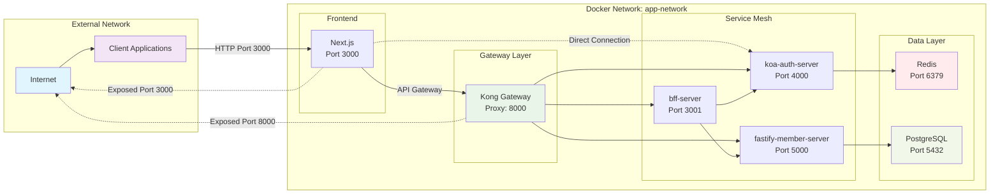

# E-Commerce 플랫폼

마이크로서비스 아키텍처 기반의 이커머스 플랫폼으로, Kong API Gateway와 BFF(Backend for Frontend) 패턴을 적용한 현대적인 웹 애플리케이션입니다.

## 🏗️ 시스템 아키텍처

```mermaid
graph TB
    subgraph "External"
        Client[클라이언트<br/>브라우저/앱]
    end

    subgraph "Frontend Layer"
        Frontend[Next.js<br/>프론트엔드 Proxy<br/>:3000<br/>API Routes /api/*<br/>HttpOnly 쿠키 → Bearer 토큰 변환]
    end

    subgraph "Internal Docker Network<br/>(외부 접근 차단)"
        subgraph "API Gateway"
            Kong[Kong API Gateway<br/>:8000<br/>• API 프록시<br/>• 토큰 검증<br/>• 멱등성 처리]
        end

        subgraph "Core Services"
            Auth[Auth 서비스<br/>Koa.js<br/>:4000<br/>• JWT 발급/검증<br/>• 사용자 인증]
            Member[Member 서비스<br/>Fastify<br/>:5000<br/>• 회원 관리<br/>• CRUD 연산]
            BFF[BFF Server<br/>Fastify<br/>:3001<br/>• API 집계<br/>• 데이터 변환]
        end

        subgraph "Data Layer"
            Redis[(Redis<br/>토큰 저장<br/>세션 관리<br/>멱등성 캐시)]
            PostgreSQL[(PostgreSQL<br/>Database<br/>회원 데이터)]
        end

        subgraph "Other Services"
            Other[기타 서비스들<br/>Order<br/>Product<br/>Payment]
        end
    end

    %% External connections
    Client -->|HTTP 요청| Frontend
    Frontend -->|HTTP 응답| Client

    %% Frontend to internal services
    Frontend -->|API Routes<br/>/api/*| Kong
    Frontend -.->|직접 통신| Auth

    %% Kong routing
    Kong --> BFF
    Kong --> Auth
    Kong --> Member
    Kong --> Other

    %% Service to data connections
    Auth --> Redis
    Member --> PostgreSQL
    BFF --> Auth
    BFF --> Member

    %% Styling
    style Client fill:#e3f2fd
    style Frontend fill:#f3e5f5
    style Kong fill:#e8f5e8
    style Auth fill:#fff3e0
    style Member fill:#fff3e0
    style BFF fill:#fff3e0
    style Redis fill:#ffebee
    style PostgreSQL fill:#f1f8e9
    style Other fill:#fafafa
```



## 🔄 데이터 플로우

```mermaid
sequenceDiagram
    participant C as Client
    participant F as Next.js Frontend
    participant K as Kong Gateway
    participant B as BFF Server
    participant A as Auth Service
    participant M as Member Service
    participant R as Redis
    participant DB as PostgreSQL

    Note over C,DB: 현재 구현된 아키텍처

    %% 인증 플로우
    rect rgb(255, 248, 220)
        Note over C,R: 사용자 인증 플로우
        C->>F: 로그인 요청
        F->>A: 직접 통신
        A->>R: 세션 확인
        A->>R: JWT 토큰 저장
        A-->>F: JWT 토큰 반환
        F-->>C: HttpOnly 쿠키 설정
    end

    %% API 요청 플로우
    rect rgb(240, 248, 255)
        Note over C,DB: API 요청 플로우
        C->>F: API 요청
        F->>F: 쿠키 → Bearer 토큰 변환
        F->>K: Kong Gateway 호출

        alt BFF 요청 (홈페이지 등)
            K->>K: 토큰 검증 + 멱등성 체크
            K->>B: BFF Server 라우팅
            B->>A: 인증 서비스 호출
            B->>M: 멤버 서비스 호출
            M->>DB: 데이터베이스 쿼리
            M-->>B: 데이터 반환
            B-->>K: 집계된 응답
        else 직접 서비스 요청
            K->>K: 토큰 검증 + 멱등성 체크
            K->>A: Auth 서비스 직접 호출
            A->>R: Redis 세션 확인
            A-->>K: 인증 응답
        end

        K-->>F: 최종 응답
        F-->>C: HTTP 응답
    end
```



## 🏭 Kong Gateway 플러그인 구성

```mermaid
graph TD
    Request[Incoming Request] --> Kong{Kong Gateway}

    Kong --> TokenValidator[token-validator plugin<br/>JWT 토큰 검증<br/>Auth Server 연동]
    TokenValidator --> |Valid| Idempotency[idempotency plugin<br/>중복 요청 방지<br/>Redis 저장]
    TokenValidator --> |Invalid| Reject[401 Unauthorized]

    Idempotency --> |New Request| Route[Request Routing]
    Idempotency --> |Duplicate| Cached[Cached Response<br/>from Redis]

    Route --> BFFRoute[BFF Server<br/>/api/home]
    Route --> AuthRoute[Auth Server<br/>/api/auth]
    Route --> MemberRoute[Member Server<br/>/api/members]

    BFFRoute --> Response[Response to Client]
    AuthRoute --> Response
    MemberRoute --> Response
    Cached --> Response

    style TokenValidator fill:#fff3e0
    style Idempotency fill:#e8f5e8
    style Reject fill:#ffebee
    style Cached fill:#f3e5f5
    style Response fill:#e8f5e8
```



## 🚀 주요 특징

### 🔒 보안 & 인증
- **Kong API Gateway**: 중앙집중식 API 관리 및 보안
- **JWT 기반 인증**: token-validator 플러그인으로 토큰 검증
- **Redis 세션 관리**: 확장 가능한 세션 저장소
- **멱등성 보장**: 중복 요청 방지 (Redis 기반)
- **내부 네트워크 격리**: Docker 네트워크로 서비스 보호

### ⚡ 성능 & 안정성
- **BFF 패턴**: 프론트엔드 최적화된 API 응답
- **마이크로서비스**: 서비스별 독립적 확장
- **멱등성 처리**: 안전한 재시도 메커니즘
- **Connection Pooling**: 데이터베이스 연결 최적화

### 🏗️ 아키텍처 패턴
- **Clean Architecture**: 계층 분리 및 의존성 관리
- **Domain-Driven Design**: 비즈니스 로직 중심 설계
- **API Gateway Pattern**: 중앙집중식 API 관리
- **Backend for Frontend**: 클라이언트 최적화

## 📦 서비스 구성

### 🌐 Kong API Gateway (:8000)
```yaml
역할: API 프록시 및 중앙 관리
기술 스택: Kong Community Edition
주요 기능:
  - API 라우팅 및 프록시
  - JWT 토큰 검증 (token-validator)
  - 멱등성 처리 (idempotency + Redis)
  - 플러그인 기반 확장

현재 활성 플러그인:
  - token-validator: JWT 토큰 검증
  - idempotency: 중복 요청 방지

관리 포트: :8001
```

### 🔄 BFF Server (:3001)
```yaml
역할: Frontend를 위한 API 집계 서버
기술 스택: Fastify + TypeScript
주요 기능:
  - 마이크로서비스 API 집계
  - 프론트엔드 최적화된 응답 변환
  - 에러 처리 및 로깅
  - Swagger 문서 자동 생성

주요 엔드포인트:
  - GET /api/home: 홈페이지 데이터 집계
  - GET /health: 헬스 체크
  - GET /docs: API 문서
```

### 🔐 Auth Server (:4000)
```yaml
역할: 사용자 인증 및 권한 관리
기술 스택: Koa.js + TypeScript
주요 기능:
  - JWT 토큰 발급 및 검증
  - 사용자 인증/인가
  - Redis 기반 세션 관리
  - 비밀번호 암호화 (bcrypt)

주요 엔드포인트:
  - POST /api/auth/login: 사용자 로그인
  - POST /api/auth/register: 사용자 등록
  - POST /api/auth/refresh: 토큰 갱신
  - POST /api/auth/logout: 로그아웃
```

### 👥 Member Server (:5000)
```yaml
역할: 회원 정보 관리
기술 스택: Fastify + Prisma + TypeScript
주요 기능:
  - 회원 CRUD 연산
  - Prisma ORM 기반 데이터 접근
  - 멱등성 미들웨어 지원
  - PostgreSQL 연동

주요 엔드포인트:
  - GET /api/members: 회원 목록 조회
  - POST /api/members: 회원 생성
  - GET /api/members/:id: 특정 회원 조회
  - PUT /api/members/:id: 회원 정보 수정
  - DELETE /api/members/:id: 회원 삭제
```

### 🎨 Frontend (:3000)
```yaml
역할: 사용자 인터페이스
기술 스택: Next.js 14 + TypeScript
아키텍처: Domain-Driven Design (DDD)
주요 기능:
  - App Router 기반 라우팅
  - 도메인별 상태 관리 (Zustand)
  - Server-Side Rendering
  - HttpOnly 쿠키 → Bearer 토큰 변환

디렉토리 구조:
  - src/domains/: 도메인별 로직 분리
  - src/components/: 재사용 가능한 컴포넌트
  - src/api/: API 클라이언트
```

## 🌐 네트워크 구성



## 🚀 시작하기

### 📋 요구사항
- Node.js 18+
- npm 9+
- Docker & Docker Compose
- Redis (Cloud 또는 로컬)

### 🛠️ 설치 및 실행

1. **저장소 클론**
```bash
git clone [repository-url]
cd [repository-name]
```

2. **의존성 설치**
```bash
# 공통 모듈
cd common && npm install && cd ..

# BFF 서버
cd bff-server && npm install && cd ..

# 인증 서버
cd koa-auth-server && npm install && cd ..

# 회원 서버
cd fastify-member-server && npm install && cd ..

# 프론트엔드
cd ecommerce-app && npm install && cd ..
```

3. **환경 변수 설정**

**Kong 설정**
```bash
# kong/.env
KONG_DATABASE=off
KONG_DECLARATIVE_CONFIG=/tmp/kong.yml
KONG_PROXY_ACCESS_LOG=/dev/stdout
KONG_ADMIN_ACCESS_LOG=/dev/stdout
KONG_PROXY_ERROR_LOG=/dev/stderr
KONG_ADMIN_ERROR_LOG=/dev/stderr
KONG_ADMIN_LISTEN=0.0.0.0:8001

# Redis 설정 (클라우드 또는 로컬)
REDIS_URL=your-redis-host
REDIS_PORT=6379
REDIS_PASSWORD=your-redis-password
REDIS_DB=0
IDEMPOTENCY_TTL=3600

# 서비스 URL
MEMBER_SERVER_URL=http://fastify-member-server:5000
AUTH_SERVER_URL=http://koa-auth-server:4000
BFF_SERVER_URL=http://bff-server:3001

# 활성 플러그인
KONG_PLUGINS=token-validator,idempotency
```

**기타 서비스 환경 변수**
```bash
# 각 서비스 디렉토리에서
cp .env.example .env
# 필요한 값들을 설정
```

4. **Docker Compose 실행**
```bash
docker-compose up --build
```

## 🌐 서비스 엔드포인트

| 서비스 | 포트 | URL | 설명 |
|--------|------|-----|------|
| Kong Gateway | 8000 | http://localhost:8000 | API Gateway 프록시 |
| BFF Server | 3001 | http://localhost:3001 | Backend for Frontend |
| Auth Server | 4000 | http://localhost:4000 | 인증 서비스 |
| Member Server | 5000 | http://localhost:5000 | 회원 서비스 |
| Frontend | 3000 | http://localhost:3000 | 웹 애플리케이션 |

## 📊 API 사용 예시

### 1. 사용자 인증
```bash
# 로그인
curl -X POST http://localhost:4000/api/auth/login \
  -H "Content-Type: application/json" \
  -d '{"email": "test@example.com", "password": "password123"}'
```

### 2. Kong Gateway를 통한 API 호출
```bash
# BFF 서버 호출 (홈페이지 데이터)
curl http://localhost:8000/api/home \
  -H "Authorization: Bearer your-jwt-token" \
  -H "X-Idempotency-Key: unique-key-123"

# 회원 서비스 호출
curl http://localhost:8000/api/members \
  -H "Authorization: Bearer your-jwt-token" \
  -H "X-Idempotency-Key: unique-key-456"
```

## 🧪 테스트

### 단위 테스트
```bash
# 전체 테스트
npm run test:all

# 서비스별 테스트
cd [service-directory]
npm test
```

### 통합 테스트
```bash
# Kong Gateway 연결 테스트
curl http://localhost:8000/api/home \
  -H "Authorization: Bearer test-token" \
  -H "X-Idempotency-Key: test-key"

# 멱등성 테스트 (같은 키로 재요청)
curl http://localhost:8000/api/home \
  -H "Authorization: Bearer test-token" \
  -H "X-Idempotency-Key: test-key"
```

## 🔧 개발 가이드

### 새로운 서비스 추가
1. **Kong에 서비스 추가**
```yaml
# kong/kong.yml.template
services:
  - name: new-service
    url: http://new-service:port
    routes:
      - name: new-route
        paths:
          - /api/new
        plugins:
          - name: token-validator
          - name: idempotency
```

2. **Docker Compose에 서비스 추가**
```yaml
# docker-compose.yaml
new-service:
  build: ./new-service
  container_name: new-service
  networks:
    - app-network
```

### Kong 플러그인 설정 변경
```bash
# 설정 변경 후 Kong 재시작
docker-compose restart kong

```

## 🚀 배포 가이드

### 프로덕션 환경 변수
```bash
# kong/.env.prod
KONG_PLUGINS=
REDIS_URL=
AUTH_SERVER_URL=
MEMBER_SERVER_URL=
BFF_SERVER_URL=
```

### Docker 프로덕션 빌드
```bash
# 프로덕션 모드로 빌드 및 실행
docker-compose -f docker-compose.prod.yml up --build -d
```

## 🔮 향후 계획

### Phase 1: 현재 완료된 기능 ✅
- Kong API Gateway 구축
- BFF 서버 구현
- JWT 기반 인증 체계
- 멱등성 처리 (Redis)
- 마이크로서비스 아키텍처

### Phase 2: 성능 최적화 (진행 예정)
- [ ] **Kong 엔드포인트 캐싱**: 플러그인 적용
- [ ] **응답 캐싱 전략**: 엔드포인트별 TTL 설정
- [ ] **CDN 연동**: 정적 자원 캐싱

### Phase 3: 모니터링 & 관찰 가능성
- [ ] **메트릭 수집**: Prometheus + Grafana
- [ ] **분산 추적**: Jaeger/Zipkin 연동
- [ ] **로그 집계**: ELK Stack 구축
- [ ] **알림 체계**: Slack/Email 통합

### Phase 4: 인프라 확장
- [ ] **Kubernetes 배포**: Helm Chart 작성
- [ ] **Auto Scaling**: HPA/VPA 구성
- [ ] **Multi-Region**: 글로벌 배포
- [ ] **Disaster Recovery**: 백업/복구 전략

## 🔍 트러블슈팅

### 일반적인 문제들

**Kong Gateway 연결 실패**
```bash
# Kong 상태 확인
docker logs kong

# 네트워크 연결 확인
docker exec -it kong ping bff-server
```

**Redis 연결 문제**
```bash
# Redis 연결 테스트
docker exec -it kong redis-cli -h redis-host ping
```

**토큰 검증 실패**
```bash
# Auth 서버 로그 확인
docker logs koa-auth-server

# 토큰 유효성 수동 확인
curl http://localhost:4000/api/auth/verify \
  -H "Authorization: Bearer your-token"
```

## 📚 참고 문서

- [Kong Gateway 공식 문서](https://docs.konghq.com/)
- [Fastify 문서](https://www.fastify.io/)
- [Next.js 문서](https://nextjs.org/docs)
- [Prisma ORM 문서](https://www.prisma.io/docs)
- [Docker Compose 문서](https://docs.docker.com/compose/)
- [Koa 문서](https://koajs.com/)

## 📄 라이선스

MIT License

---
